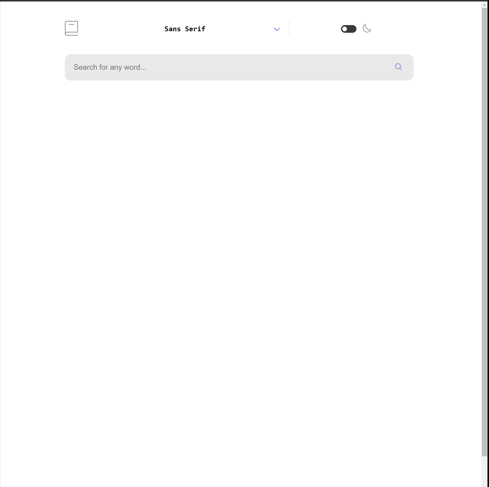
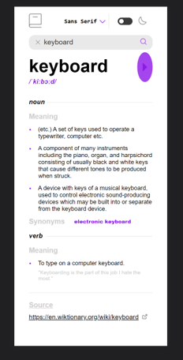
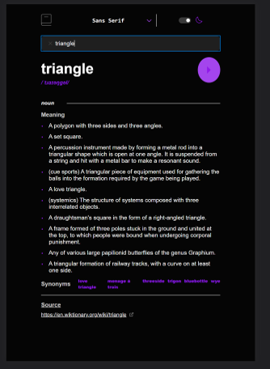

# Frontend Mentor - Dictionary web app solution

This is a solution to the [Dictionary web app challenge on Frontend Mentor](https://www.frontendmentor.io/challenges/dictionary-web-app-h5wwnyuKFL). Frontend Mentor challenges help you improve your coding skills by building realistic projects. 

## Table of contents

- [Overview](#overview)
  - [The challenge](#the-challenge)
  - [Screenshot](#screenshot)
  - [Links](#links)
- [My process](#my-process)
  - [Built with](#built-with)
  - [What I learned](#what-i-learned)
  - [Continued development](#continued-development)
  - [Useful resources](#useful-resources)
- [Author](#author)
- [Acknowledgments](#acknowledgments)

**Note: Delete this note and update the table of contents based on what sections you keep.**

## Overview

### The challenge

Users should be able to:

- Search for words using the input field
- See the Free Dictionary API's response for the searched word
- See a form validation message when trying to submit a blank form
- Play the audio file for a word when it's available
- Switch between serif, sans serif, and monospace fonts
- Switch between light and dark themes
- View the optimal layout for the interface depending on their device's screen size
- See hover and focus states for all interactive elements on the page
- **Bonus**: Have the correct color scheme chosen for them based on their computer preferences. _Hint_: Research `prefers-color-scheme` in CSS.

### Screenshot

  
  

**Note: Delete this note and the paragraphs above when you add your screenshot. If you prefer not to add a screenshot, feel free to remove this entire section.**

### Links

- Solution URL: [Add solution URL here](https://your-solution-url.com)
- Live Site URL: [Live Site](https://urealaden.github.io/dictionary_app/)

## My process

### Built with

- Semantic HTML5 markup
- CSS custom properties
- Flexbox
- CSS Grid
- Mobile-first workflow
- FluentUI React
- [React](https://reactjs.org/) - JS library

**Note: These are just examples. Delete this note and replace the list above with your own choices**

### What I learned

In this project i played around with context instead of props which worked out great. I also explored Error Boundarys which was interesting but didn't really work as expected. Perhaps I'll explore it a bit more in detail for the next challenge. I learned more about using class components which was interesting. My intention for using the C# project was to query the database for a specific word, if it was in the database return the object otherwise query the API, update the database and then return. That proved more time consuming and complex so deferred. Hopefully I'll get it in the next one.

### Continued development

- Definitely want to explore Error Boundaries in depth
- Implementing Databases in C#

## Author

- Website - [Leaundrae Mckinney](https://linkedin.com/leaundraemckinney)
- Frontend Mentor - [@UreaLaden](https://www.frontendmentor.io/profile/urealaden)

## Acknowledgments

Quick shout out to the makers of ChatGPT. Really cut development time in half.